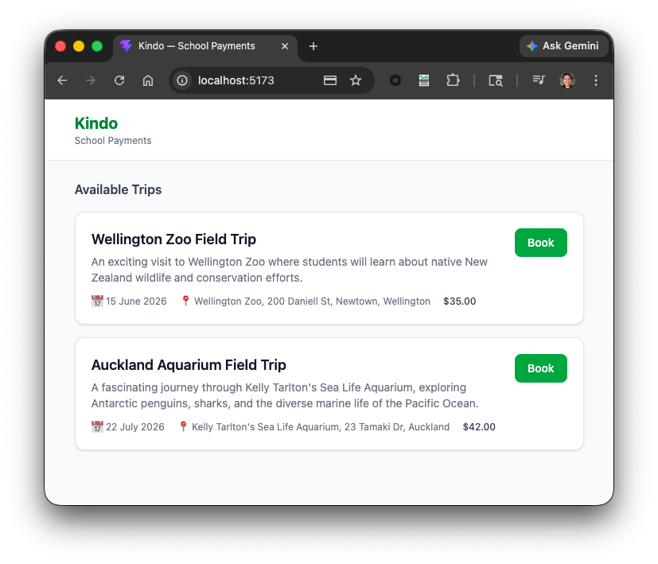
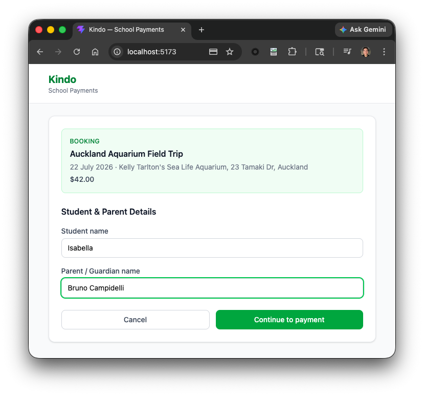
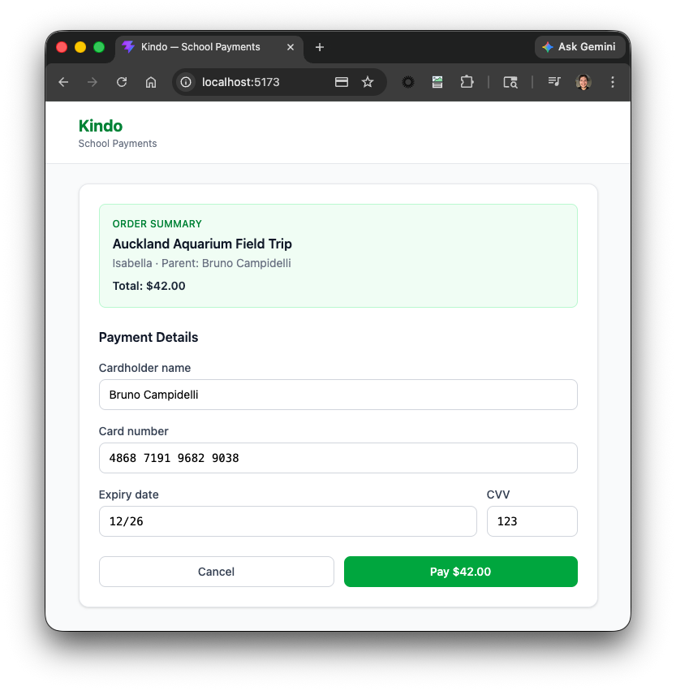
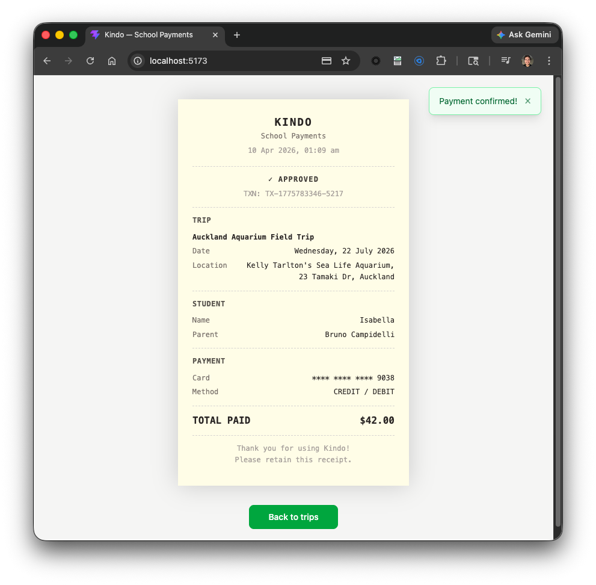

# Kindo Frontend

React + TypeScript single-page application for school trip payments, backed by the Kindo FastAPI backend.

---

## Tech Stack

- **React 19** with TypeScript
- **Vite 8** (build + dev server)
- **Tailwind CSS 4** (utility-first styling)
- **card-validator** — Luhn-based card number, expiry, and CVV validation
- **Vitest + Testing Library** — unit and component tests

---

## Getting Started

```bash
cd frontend
npm install
cp .env.example .env      # set VITE_API_URL if needed
npm run dev               # http://localhost:5173
```

### Available Scripts

| Command | Description |
|---|---|
| `npm run dev` | Start local dev server with HMR |
| `npm run build` | Type-check + production build |
| `npm test` | Run test suite (vitest) |
| `npm run lint` | ESLint |

---

## Environment Variables

| Variable | Default | Description |
|---|---|---|
| `VITE_API_URL` | `http://localhost:8000` | Base URL of the backend API |
| `VITE_PAYMENT_TIMEOUT_MS` | `30000` | How long to poll before showing a "taking too long" warning |

Copy `.env.example` to `.env` for local development. Production values are set in `render.yaml`.

---

## Screen Flow

The app is a linear wizard with four screens managed in `App.tsx`.

```
Trips  ──book──▶  Registration  ──continue──▶  Payment  ──submit──▶  Receipt
                  (creates booking)            (uses booking_id)   (fetches receipt)
                       │                           │
                    cancel                      cancel
                       │                           │
                       ▼                           ▼
                     Trips                    Registration
```

### 1 — Trip List

Fetches available trips from `GET /api/v1/trips` and displays them as cards.



---

### 2 — Registration Form

Collects **student name** and **parent/guardian name** before payment.  
Both fields are required and trimmed on submit.

On continue, calls `POST /api/v1/bookings` to create a booking in `PENDING_PAYMENT` status before advancing to the payment screen. If the user navigates back and re-submits the same details, the existing booking is reused rather than creating a duplicate.



---

### 3 — Payment Form

Collects card details with live formatting and validation:
- **Cardholder name** — pre-filled from parent name, editable
- **Card number** — formatted in groups of 4, validated via Luhn algorithm
- **Expiry date** — auto-formatted to `MM/YY`
- **CVV** — 3 digits

On submit, creates an `AbortController` and starts the configurable timeout immediately (before the request is sent), then calls `POST /api/v1/payments` with the `booking_id` from the prior step. The full-screen **Processing** modal appears as soon as Pay is clicked. Once the payment is created, the frontend polls `GET /api/v1/payments/{id}` every 2 seconds until the status changes or the timeout fires.



---

### 4 — Payment Receipt

Shown on `status: "success"`. After polling returns a successful status, the app fetches `GET /api/v1/receipts/bookings/{id}` to retrieve the full receipt. Styled as a thermal EFTPOS receipt (pale yellow, monospace font, serrated edges). Displays:
- Trip title, date, and location
- Student and parent names
- Masked card number (`**** **** **** XXXX`)
- Transaction ID
- Total paid

A green **"Payment confirmed!"** toast appears in the top-right corner.



---

## Error Handling

| Scenario | Behaviour |
|---|---|
| Booking creation fails | Red error toast — user stays on registration screen |
| Payment polling returns `failed` | Red error toast with the API's `error_message` |
| Payment exceeds `VITE_PAYMENT_TIMEOUT_MS` | Amber warning toast — user can retry |
| Network / API error during any payment step | Red error toast with error detail |
| Failed to submit payment | Red error toast |
| AbortError after timeout fires | Silently swallowed — timeout toast already shown |

---

## Assumptions & Constraints

- **One active trip per session.** The wizard does not support a cart or multiple trips.
- **Booking is created at registration time.** `POST /api/v1/bookings` is called when the user submits the registration form, not when they submit payment. If the user navigates back and re-submits unchanged details, the existing booking is reused.
- **Card data is never stored client-side.** Only the masked number is displayed on the receipt; full card details are sent once to the backend and not retained.
- **Timeout covers the full payment operation.** The `AbortController` and timeout are created before the initial `POST /api/v1/payments` call, so a slow backend POST also triggers the timeout — not just the polling phase.
- **Polling only** — no WebSocket or webhook support. The frontend polls every 2 seconds until success, failure, or timeout.
- **Single school.** `school_id` is hardcoded in the backend seed; the frontend has no school-selection step.
- **No authentication.** Any user can browse trips and submit a payment. Auth is out of scope for this challenge.
- **No payment retry flow.** If a payment fails, the user navigates back to the trip list and starts over.
- **Mobile-first layout** with a max-width of `2xl` (672 px). Not optimised for wide desktop layouts.
- **English (NZ) locale only.** Dates and currency are formatted for `en-NZ`.

---

## Deployment

Deployed as a Render Static Site. See `render.yaml` for the build config.

Production URL: **https://kindo-8r9m.onrender.com**
